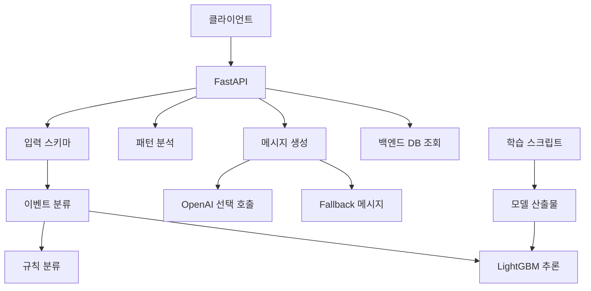

# 쿵로그 AI 모듈

## 프로젝트 소개

쿵로그 AI 모듈은 층간소음 센서 이벤트를 분류하고, 최근 이벤트 패턴을 분석하며, 필요 시 중재 메시지를 생성하는 Python 기반 AI API 서버입니다. 저장소 기준으로 FastAPI API, 규칙 기반 이벤트 분류기, LightGBM 추론 런타임, OpenAI 기반 메시지 생성 로직, 학습용 데이터셋 빌더와 테스트 코드가 함께 구성되어 있습니다.

이 프로젝트는 센서에서 수집된 소음·진동 데이터를 단순 로그로만 남기는 것이 아니라, `impact_noise`, `repeated_vibration`, `daily_noise`, `background_noise`, `unknown`과 같은 이벤트 유형과 `low`, `medium`, `high`, `critical` 심각도로 구조화하는 데 초점을 둡니다. 또한 최근 7일 기준 반복 발생, 야간 이벤트, 10분 내 클러스터 발생 여부를 분석해 중재 또는 escalation 필요 여부를 판단합니다.

OpenAI 연동은 항상 호출되는 구조가 아니라, 설정값과 심각도 조건을 만족할 때 선택적으로 사용됩니다. OpenAI 호출이 비활성화되었거나 실패하거나 안전하지 않은 톤이 감지되는 경우에는 fallback 템플릿으로 메시지를 생성하도록 설계되어 있습니다.

## 문제 정의

층간소음 이벤트는 단일 센서 값만으로 판단하기 어렵고, 시간대, 반복성, 진동 강도, 지속 시간, 최근 발생 맥락을 함께 고려해야 합니다. 이 저장소는 이러한 문제를 해결하기 위해 이벤트 단위 입력 계약을 정의하고, 규칙 기반 분류와 LightGBM 기반 추론을 함께 사용할 수 있는 구조를 구현했습니다.

또한 중재 메시지는 민감한 상황에서 사용될 가능성이 있으므로, 비난·위협·감정적 표현을 줄이고 중립적인 안내 문구를 생성해야 합니다. 이를 위해 OpenAI 응답에는 JSON Schema 기반 출력 형식과 톤 검증, fallback 메시지 경로가 포함되어 있습니다.

프로젝트의 실제 서비스 도메인, 사용자 시나리오, 배포 운영 여부는 저장소만으로는 일부 확인이 필요합니다.

## 폴더 구조
.
├── ai/
│   ├── dashboard_api.py          # FastAPI API 및 대시보드 엔드포인트
│   ├── serve.py                  # Uvicorn 실행 진입점
│   ├── config.py                 # 환경변수 기반 AI 설정
│   ├── schemas.py                # 이벤트, 분류 결과, 패턴 결과 데이터 구조
│   ├── event_classifier.py       # 규칙 기반 및 LightGBM 연동 이벤트 분류
│   ├── lgbm_runtime.py           # LightGBM 모델 로딩 및 추론 런타임
│   ├── ml_features.py            # 모델 입력 feature 생성
│   ├── pattern_analyzer.py       # 반복 패턴 및 중재 필요 여부 분석
│   ├── message_generator.py      # OpenAI/fallback 메시지 생성 분기
│   ├── openai_client.py          # OpenAI Responses API 래퍼
│   ├── fallback_templates.py     # OpenAI 실패 시 기본 메시지 생성
│   ├── training/                 # LightGBM 데이터셋 빌드, 학습, 평가 스크립트
│   ├── tests/                    # 단위 테스트
│   └── artifacts/                # 모델, 평가 결과, 데이터셋 요약 산출물
├── deploy/                       # 로컬 실행 및 ngrok 배포 보조 스크립트
├── requirements.txt              # API 실행 의존성
├── requirements-train.txt        # 학습용 추가 의존성
├── railway.json                  # Railway 배포 설정
├── railpack.json                 # Railpack 시스템 패키지 설정
├── runtime.txt                   # Python 런타임 버전
├── .env.example                  # 환경변수 예시
└── README.md

## 주요 기능

- 센서 이벤트 분류
  - `ai/event_classifier.py`에서 `EventFeatures` 입력을 기반으로 이벤트 유형과 심각도를 분류합니다.
  - 분류 대상: `background_noise`, `daily_noise`, `impact_noise`, `repeated_vibration`, `unknown`
  - 심각도: `low`, `medium`, `high`, `critical`

- 이벤트 입력 계약 정의
  - `ai/schemas.py`의 `EventFeatures`가 센서 이벤트 입력 구조를 정의합니다.
  - `recent_count_10min`은 최근 10분 동안의 의미 있는 이벤트 수로 제한되며, raw 샘플 카운트가 아님을 코드 주석과 로직에서 명시합니다.

- LightGBM 기반 추론 런타임
  - `ai/lgbm_runtime.py`에서 LightGBM 모델 파일을 lazy loading 방식으로 로드합니다.
  - 모델 artifact, label map, feature spec을 검증하고, confidence threshold 미달 또는 모델 로드 실패 시 fallback하도록 구성되어 있습니다.

- 규칙 기반 분류와 모델 기반 분류의 병행
  - `AI_CLASSIFIER_BACKEND` 설정을 통해 `rule`, `hybrid`, `lightgbm` 백엔드를 선택할 수 있습니다.
  - `AI_LGBM_SHADOW_MODE` 설정을 통해 rule 결과와 LightGBM 결과를 비교 로그로 남길 수 있습니다.

- 패턴 분석
  - `ai/pattern_analyzer.py`에서 최근 N일 이벤트를 기준으로 반복 발생 일수, 야간 이벤트 수, 10분 내 최대 이벤트 수, 중재 이후 재발 여부를 계산합니다.
  - 결과로 `needs_mediation`, `needs_escalation`, `pattern_label`을 반환합니다.

- AI 중재 메시지 생성
  - `ai/message_generator.py`, `ai/openai_client.py`, `ai/fallback_templates.py`에서 중재 메시지를 생성합니다.
  - OpenAI Responses API 호출이 가능하며, 실패 시 fallback 메시지로 대체됩니다.
  - OpenAI 응답은 `event_summary`, `resident_message`, `admin_summary`, `recommended_action`, `tone_check` 형식을 요구합니다.

- FastAPI 기반 API 서버
  - `ai/dashboard_api.py`에서 `/health`, `/api/v1/ai/classify-event`, `/api/v1/ai/analyze`, `/api/v1/ai/analyze-patterns` 등의 엔드포인트를 제공합니다.
  - 대시보드용 통계 API로 `/api/v1/noise/distribution`, `/api/v1/dashboard/households`, `/api/v1/dashboard/urgent`, `/api/v1/dashboard/today-events` 등이 구현되어 있습니다.

- 학습 데이터셋 구성 및 모델 학습 스크립트
  - `ai/training/build_lgbm_dataset.py`는 센서 CSV와 라벨 CSV를 조인해 LightGBM 학습 데이터셋을 생성합니다.
  - `train_is_meaningful_lgbm.py`, `train_event_type_lgbm.py`, `evaluate_lgbm.py`가 학습 및 평가 흐름을 담당합니다.

- 테스트 코드
  - `ai/tests/`에 이벤트 분류, 패턴 분석, OpenAI 클라이언트, LightGBM 런타임, feature 생성, 데이터셋 빌더 테스트가 포함되어 있습니다.

## 기술 스택

### 언어 및 런타임

- Python 3.12
  - `runtime.txt`에서 `python-3.12` 확인

### API 서버

- FastAPI
  - `requirements.txt` 기준 `fastapi==0.136.1`
- Uvicorn
  - `requirements.txt` 기준 `uvicorn==0.46.0`

### 데이터 모델 및 검증

- Pydantic
  - `requirements.txt` 기준 `pydantic==2.13.3`
- Python dataclass
  - `ai/schemas.py`, `ai/config.py`에서 사용

### 데이터베이스 연동

- SQLAlchemy
  - `requirements.txt` 기준 `SQLAlchemy==2.0.49`
  - `ai/dashboard_api.py`에서 백엔드 DB 테이블 조회에 사용
- SQLite 기본 경로
  - `BACKEND_DB_URL`이 없을 경우 `BACKEND_DB_PATH` 또는 `./_backend_db_expand/kunglog.db`를 사용하도록 구현

### AI 및 머신러닝

- OpenAI Python SDK
  - `requirements.txt` 기준 `openai==2.2.0`
  - `ai/openai_client.py`에서 Responses API 호출
- LightGBM
  - `requirements.txt` 기준 `lightgbm==4.6.0`
  - `ai/lgbm_runtime.py`, `ai/training/`에서 사용
- NumPy
  - `requirements.txt` 기준 `numpy==2.3.4`
- pandas, scikit-learn, joblib
  - `requirements-train.txt` 기준 학습 파이프라인용 의존성

### 테스트

- pytest
  - 테스트 실행 명령은 README와 테스트 구조에서 `python -m pytest -q`로 확인
  - 단, `pytest` 의존성이 `requirements.txt`에 명시되어 있지는 않아 설치 환경 확인이 필요합니다.

### 배포 관련

- Railway
  - `railway.json`에서 Railpack 빌더, `python -m ai.serve` 시작 명령, `/health` 헬스체크 확인
- Railpack
  - `railpack.json`에서 `libgomp1` apt package 설정 확인
- ngrok 로컬 고정 URL 배포 스크립트
  - `deploy/README.md`, `deploy/*.ps1`에서 확인

## 아키텍처 및 구조

- `클라이언트`: API 요청 주체입니다. 별도 프론트엔드 코드는 저장소에서 확인되지 않습니다.
- `FastAPI`: `ai/dashboard_api.py`, `ai/serve.py`를 근거로 작성했습니다.
- `입력 스키마`: `ai/schemas.py`, `ai/dashboard_api.py`의 Pydantic 요청 모델을 근거로 작성했습니다.
- `이벤트 분류`: `ai/event_classifier.py`에서 규칙 기반 분류와 LightGBM 백엔드 선택 로직을 담당합니다.
- `LightGBM 추론`: `ai/lgbm_runtime.py`, `ai/ml_features.py`, `ai/artifacts/` 모델 파일을 근거로 작성했습니다.
- `패턴 분석`: `ai/pattern_analyzer.py`에서 반복 일수, 야간 발생, 클러스터, 중재 후 재발 여부를 분석합니다.
- `메시지 생성`: `ai/message_generator.py`, `ai/openai_client.py`, `ai/fallback_templates.py`를 근거로 작성했습니다.
- `백엔드 DB 조회`: `ai/dashboard_api.py`에서 SQLAlchemy로 `noise_logs`, `households`, `mediations` 계열 테이블을 조회합니다.
- `학습 스크립트`: `ai/training/` 폴더의 데이터셋 빌드, 학습, 평가 스크립트를 근거로 작성했습니다.

전체 구조는 API 요청을 중심으로 이벤트 feature를 정규화한 뒤, 분류기와 패턴 분석기를 통해 의사결정 정보를 생성하는 방식입니다. 분류기는 규칙 기반 로직을 기본 안전망으로 두고, 설정에 따라 LightGBM 모델을 사용할 수 있습니다.

메시지 생성 계층은 분류와 패턴 분석 결과를 바탕으로 중재 메시지를 생성합니다. OpenAI를 사용할 수 없는 경우에도 fallback 템플릿을 통해 응답을 반환하도록 구성되어 있어, 외부 API 장애가 전체 API 실패로 이어지지 않도록 설계되어 있습니다.

대시보드 API는 백엔드 DB 스키마를 고정적으로 가정하기보다 후보 테이블명과 컬럼명을 탐색하는 방식으로 구현되어 있습니다. 이를 통해 `noise_logs`, `noise_log`, `noise_events` 등 유사한 스키마 이름에 대응하려는 의도가 확인됩니다.

## 핵심 구현 포인트

### 1. 이벤트 단위 입력 계약으로 raw 샘플 오분류 위험 축소

`EventFeatures.recent_count_10min`은 최근 10분 raw 샘플 수가 아니라 의미 있는 이벤트 수만 허용하는 값으로 정의되어 있습니다. `ai/event_classifier.py`에서도 `_normalize_recent_count`와 주석을 통해 이 계약을 유지하며, 반복 진동 분류가 단순 샘플 과다 유입으로 오판되지 않도록 설계되어 있습니다.

### 2. 규칙 기반 분류와 LightGBM 추론의 fallback 구조

`classify_event()`는 설정에 따라 `rule`, `hybrid`, `lightgbm` 백엔드를 선택합니다. LightGBM 모델이 없거나 confidence가 기준값보다 낮으면 규칙 기반 결과를 fallback으로 사용합니다.

특히 충격 소음 데이터가 부족할 수 있는 상황을 고려해 rule 기반 impact 판단을 backup으로 유지하는 로직이 포함되어 있습니다.

### 3. 모델 feature spec 검증

`ai/ml_features.py`는 LightGBM 입력 feature column을 고정된 순서로 정의합니다. `ai/lgbm_runtime.py`는 모델 로드 시 `feature_spec.json`의 feature column과 런타임 feature column이 일치하는지 검증합니다.

이는 학습 시점과 추론 시점의 feature mismatch를 방지하기 위한 구조입니다.

### 4. 패턴 분석을 통한 중재 및 escalation 판단

`ai/pattern_analyzer.py`는 단일 이벤트가 아니라 최근 기간의 이벤트 흐름을 분석합니다. 반복 발생 일수, 야간 이벤트 수, 10분 내 최대 이벤트 수, 중재 메시지 이후 재발 여부를 계산하고 `needs_mediation`, `needs_escalation`으로 의사결정 신호를 제공합니다.

### 5. OpenAI 응답 안정성 확보

`ai/openai_client.py`는 OpenAI 응답을 JSON Schema로 제한하고 필수 키를 검증합니다. `ai/message_generator.py`는 OpenAI 사용 조건, 금칙 표현 검사, 예외 발생 시 fallback 메시지 반환을 처리합니다.

민감한 중재 메시지 생성에서 외부 LLM 결과를 그대로 신뢰하지 않으려는 설계가 확인됩니다.

## 트러블슈팅 및 기술적 고민

### LightGBM 전환 전략

기존 README의 LightGBM Deployment Runbook과 `AI_CLASSIFIER_BACKEND`, `AI_LGBM_SHADOW_MODE` 설정을 보면, 규칙 기반 분류에서 LightGBM 기반 추론으로 단계적으로 전환하는 운영 전략이 고려되어 있습니다.

shadow mode를 통해 rule 결과와 모델 결과를 비교하고, 문제가 있을 경우 설정 변경만으로 rule backend로 되돌릴 수 있습니다.

### 모델 artifact 누락 대응

`LightGBMRuntime`은 모델 파일, label map, feature spec이 없거나 잘못된 경우 API 전체를 실패시키기보다 fallback 가능한 결과를 반환하도록 구성되어 있습니다.

### 메시지 생성 실패 대응

OpenAI API key 누락, SDK 미설치, API 실패, 빈 응답, JSON 파싱 실패, 안전하지 않은 톤 감지 시 fallback 메시지를 반환하도록 구현되어 있습니다.
